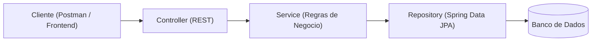

# 🎙️ CodeCast API

API de agendamento desenvolvida para o desafio técnico **DEV1** do onboarding técnico
da CODE[] Jr., simulando o sistema interno de gestão de estúdios do CodeCast. Um
estúdio de podcast que precisa controlar a disponibilidade das suas salas, dos seus
apresentadores e evitar conflitos de horário nas gravações.

## 📋 Sobre o projeto

A API gerencia três módulos principais:

- **Estúdios** — cadastro, consulta, atualização e remoção de salas de gravação.
- **Apresentadores (Hosts)** — ciclo de vida completo dos locutores autorizados.
- **Agendamentos** — reservas de estúdio por horário, com validação automática de
  conflitos e suporte a fuso horário.

Além da API, o projeto conta com uma interface web (frontend) para facilitar o uso
no dia a dia. Detalhes na seção [Frontend](#-frontend) abaixo.

## 🏗️ Arquitetura

O backend segue uma arquitetura em camadas:



- **Controller**: recebe e valida o formato das requisições HTTP.
- **Service**: contém as regras de negócio (ex: verificação de conflito de horário).
- **Repository**: acesso a dados via Spring Data JPA.
- **DTOs**: desacoplam o formato da API do modelo interno (`Entity`).
- **Exception Handler**: padroniza as respostas de erro da API.

## 🛠️ Tecnologias utilizadas

- Java 21 + Spring Boot 4.1.0 (Spring Web, Spring Data JPA, Validation)
- Banco H2 (desenvolvimento local) / PostgreSQL (produção/Docker)
- Maven
- JUnit 5 (testes automatizados)
- Springdoc OpenAPI 3.0.3 (Swagger)
- Docker e Docker Compose

## ✅ Pré-requisitos

- JDK 21 ou superior instalado (`java -version`)
- Maven (opcional — o projeto já inclui o Maven Wrapper `./mvnw`)
- Docker e Docker Compose (apenas se for usar o modo containerizado)

## 🚀 Como executar localmente

```bash
git clone <url-do-seu-repositorio>
cd codecast-api
./mvnw spring-boot:run
```

A API estará disponível em `http://localhost:8080`. O banco H2 em memória é criado
automaticamente — não é necessário nenhum setup adicional.

Console do H2 (para inspecionar os dados): `http://localhost:8080/h2-console`
(JDBC URL: `jdbc:h2:mem:codecastdb`, usuário: `sa`, senha: em branco).

## 📚 Documentação interativa da API (Swagger)

Com a aplicação em execução, acesse:

```
http://localhost:8080/swagger-ui.html
```

Todos os endpoints de `Studio`, `Host` e `Booking` estão documentados automaticamente
a partir do código, e podem ser testados diretamente por essa interface.

## 🧪 Como executar os testes

```bash
./mvnw test
```

A suíte cobre o cenário mais crítico do desafio: a criação de um agendamento sem
conflito, e a rejeição de um agendamento com horário sobreposto no mesmo estúdio
(`BookingServiceTest`).

## 📁 Estrutura de pastas

```
codecast-api/
├── src/main/java/com/codecast/codecast_api/
│   ├── controller/
│   ├── service/
│   ├── repository/
│   ├── model/
│   ├── dto/
│   └── exception/
├── src/main/resources/application.properties
├── src/test/java/com/codecast/codecast_api/...
├── frontend-app/
└── pom.xml
```

## 🔌 Endpoints principais

| Método | Rota | Descrição |
|---|---|---|
| `POST` | `/api/studios` | Cria um estúdio |
| `GET` | `/api/studios` | Lista todos os estúdios |
| `GET` | `/api/studios/{id}` | Busca um estúdio por ID |
| `PUT` | `/api/studios/{id}` | Atualiza um estúdio |
| `DELETE` | `/api/studios/{id}` | Remove um estúdio |
| `POST` | `/api/hosts` | Cria um apresentador |
| `GET` | `/api/hosts` | Lista todos os apresentadores |
| `GET` | `/api/hosts/{id}` | Busca um apresentador por ID |
| `PUT` | `/api/hosts/{id}` | Atualiza um apresentador |
| `DELETE` | `/api/hosts/{id}` | Remove um apresentador |
| `POST` | `/api/bookings` | Cria um agendamento (valida conflito de horário) |
| `GET` | `/api/bookings` | Lista todos os agendamentos |
| `GET` | `/api/bookings/{id}` | Busca um agendamento por ID |
| `PUT` | `/api/bookings/{id}` | Atualiza um agendamento (revalida conflito) |
| `DELETE` | `/api/bookings/{id}` | Remove um agendamento |

## 🎨 Frontend

Além da API, foi desenvolvida uma interface web para consumir os endpoints e
facilitar o uso no dia a dia do CodeCast. O código fonte está na pasta
[`frontend-app/`](./frontend-app).

Para que o frontend (rodando em outro domínio/porta) consiga se comunicar com a
API, foi habilitado CORS nos controllers (`@CrossOrigin`).

> Detalhes completos sobre como o frontend foi construído, as ferramentas usadas
> e a integração com a API estão documentados no
> [relatório técnico](./relatorio-tecnico.md).

## 📄 Relatório Técnico

O raciocínio completo do desenvolvimento, as decisões técnicas, as dificuldades
encontradas e as melhorias futuras estão documentados em
[`relatorio-tecnico.md`](./relatorio-tecnico.md).

## 👤 Autor
Desenvolvido por Maria Eduarda

- GitHub: [@seu-usuario] https://github.com/eduarda-ac
- LinkedIn: [seu-nome] https://www.linkedin.com/in/albuquerquemaria/
Projeto desenvolvido para o onboarding técnico da **CODE[] Jr.** — Desafio DEV1.