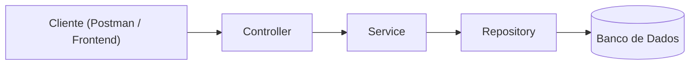

# Relatório Técnico - Desafio DEV1: CodeCast API

## 1. Contextualização do problema

O CodeCast é um estúdio de podcast que estava tendo problemas para organizar a
agenda das suas salas de gravação. Vários produtores usam o sistema ao mesmo tempo,
e sem um controle automático, é fácil duas pessoas reservarem o mesmo estúdio no
mesmo horário sem perceber. Além disso, a empresa estava crescendo e precisava de
um jeito organizado de cadastrar novos estúdios e apresentadores conforme a
operação fosse aumentando.

O desafio pedia para eu construir o núcleo de uma API que resolvesse esses três
problemas: gerenciar os estúdios, gerenciar os apresentadores, e principalmente
controlar os agendamentos de forma que nunca aceite duas reservas conflitantes para
a mesma sala.

## 2. Interpretação do desafio

Antes de começar a programar, eu li o edital algumas vezes pra entender o que
estava sendo pedido e o que estava sendo avaliado. Entendi que tinha três módulos
(Estúdios, Apresentadores e Agendamentos), mas que o módulo de Agendamentos era o
mais importante, porque é nele que está o problema real de negócio: garantir que
o sistema não aceite dois agendamentos que se sobrepõem no mesmo estúdio.

Como eu nunca tinha trabalhado com Spring Boot, esse desafio foi também minha
primeira vez aprendendo o framework do zero: entender o que é injeção de
dependência, como funciona a separação entre Controller, Service e Repository, e
como o Spring conecta tudo isso usando anotações.

## 3. Arquitetura e abordagem escolhida

Segui a arquitetura em camadas, que é o padrão usado em projetos Spring Boot:



- O **Controller** só recebe a requisição HTTP e devolve a resposta, sem ter
  nenhuma regra de negócio dentro dele.
- O **Service** é onde ficam as decisões: por exemplo, verificar se já existe um
  agendamento conflitante antes de salvar um novo.
- O **Repository** é a camada que conversa com o banco de dados, usando o Spring
  Data JPA, sem que eu precise escrever SQL manualmente.
- Os **DTOs** (Studio, Host e Booking, cada um com versão de entrada e de saída)
  servem para nunca expor minhas entidades do banco diretamente na API, e para
  poder validar os dados que chegam antes de fazer qualquer coisa com eles.

Sobre a nomenclatura: o edital pede kebab-case para toda a árvore de arquivos, mas
isso não é possível dentro dos arquivos `.java`. O Java exige que o nome do
arquivo seja igual ao nome da classe, em PascalCase, e nem aceita hífen em nomes de
pacote. Então usei PascalCase para as classes Java (como o próprio Java exige) e
mantive kebab-case nos arquivos de configuração e documentação.

## 4. Principais decisões técnicas

### 4.1 Modelagem de dados

- **Studio**: id, nome, capacidade máxima e uma lista de equipamentos.
- **Host**: id, nome e e-mail (com validação de formato usando `@Email`).
- **Booking**: id, referência ao Studio, referência ao Host, horário de início e
  horário de término.

### 4.2 Tratamento de fuso horário

Para o horário de início e término do agendamento, usei o tipo `OffsetDateTime` em
vez de `LocalDateTime`. A diferença é que o `OffsetDateTime` já guarda junto a
informação do fuso horário (por exemplo, `-03:00`), então o sistema sabe
exatamente a que momento absoluto aquele horário corresponde, mesmo se no futuro
ele for acessado por pessoas em fusos diferentes, que é exatamente o que o
edital pedia para eu considerar.

### 4.3 Consistência e atomicidade dos agendamentos

Essa foi a parte que exigiu mais raciocínio. Antes de criar um agendamento, o
sistema busca no banco se existe algum outro agendamento no mesmo estúdio cujo
horário se sobreponha ao que está sendo criado. A condição que usei pra detectar
sobreposição é a regra clássica de intervalos de tempo:

```
inicioExistente < fimNovo  E  fimExistente > inicioNovo
```

Implementei essa verificação como uma consulta JPQL direto no repositório
(`existsConflict`), em vez de carregar todos os agendamentos e comparar em Java,
porque assim o próprio banco de dados faz o trabalho de filtragem, o que é mais
eficiente.

Para garantir que a verificação e a criação aconteçam de forma atômica (ou seja,
sem brecha entre checar e salvar), o método de criação no Service está marcado com
`@Transactional`. Isso garante que, se alguma coisa falhar no meio do processo,
nada fica salvo parcialmente no banco.

Reconheço que essa solução resolve o caso comum, mas em um cenário de altíssima
concorrência (dois usuários criando reservas no exato mesmo milissegundo), ainda
existe uma pequena janela teórica de corrida entre a verificação e a gravação.
Isso está registrado na seção de melhorias futuras.

### 4.4 Tratamento de exceções

Criei exceções customizadas (`ResourceNotFoundException` e
`BookingConflictException`) e um `GlobalExceptionHandler` centralizado, que
intercepta essas exceções e devolve respostas padronizadas, com status HTTP
adequado (`404` para recurso não encontrado, `409` para conflito de agendamento,
`400` para dados inválidos). Também tratei o caso de JSON malformado, depois de
descobrir esse problema durante os testes manuais (detalhado na seção 5).

### 4.5 Diferenciais implementados

- **Testes automatizados** (JUnit 5): cobrem o cenário de criação válida e o
  cenário de rejeição por conflito de horário, no `BookingServiceTest`.
- **Documentação interativa** (Swagger/OpenAPI via springdoc): gera
  automaticamente a documentação de todos os endpoints a partir do código.

## 5. Dificuldades encontradas

Como essa foi minha primeira vez usando Spring Boot, encontrei bastante coisa pelo
caminho. Decidi listar aqui as principais, porque acho que mostram bem o processo
de aprendizado, não só o resultado final:

- **Entidade sem `@Entity`**: esqueci de anotar a classe `Host` como `@Entity`, o
  que impedia o Hibernate de mapear o relacionamento entre `Booking` e `Host`.
- **Imports incompletos**: várias vezes esqueci de incluir o subpacote certo nos
  imports (por exemplo, importar `BookingService` sem o `.service.` no caminho),
  o que gerava erros de "cannot be resolved" em cascata.
- **Endpoints de listagem esquecidos**: em mais de um controller, eu implementei
  os métodos de buscar por id, atualizar e remover, mas esqueci do `@GetMapping`
  simples que lista todos os registros, o que gerava erro `405 Method Not
  Allowed` ao tentar listar.
- **Erros de formatação do JSON nos testes manuais**: em alguns testes no
  Postman, escrevi o JSON sem aspas nos valores de texto, ou usei `=` em vez de
  `:`. Isso me mostrou que vale a pena tratar também o caso de JSON malformado no
  backend, então adicionei um handler específico para
  `HttpMessageNotReadableException`.
- **Incompatibilidade de versão no Swagger**: adicionei a dependência do springdoc
  na versão 2.6.0, que é compatível com Spring Boot 3.x, mas eu estou usando
  Spring Boot 4.1.0 (uma versão bem recente). Isso causava um erro de
  `NoSuchMethodError` ao acessar a documentação. Pesquisei e troquei para a
  versão 3.0.3, que é a linha do springdoc compatível com Spring Boot 4, e
  resolveu o problema.
- **CORS para o frontend**: ao integrar a interface web com a API, as
  requisições eram bloqueadas pelo navegador porque o frontend roda em um domínio
  diferente do backend. Resolvi adicionando `@CrossOrigin(origins = "*")` nos
  controllers para liberar a comunicação entre os dois.

## 6. Possíveis melhorias futuras

- Implementar um lock mais forte (por exemplo, lock pessimista no banco) para
  fechar de vez a pequena janela de concorrência mencionada na seção 4.3.
- Adicionar paginação nos endpoints de listagem, já que hoje eles retornam todos
  os registros de uma vez.
- Adicionar autenticação e autorização, para que só usuários autorizados possam
  criar ou remover agendamentos.
- Tratar de forma mais específica outros tipos de erro de validação que ainda
  caem no formato genérico do Spring.

## 7. Uso de Inteligência Artificial

Usei o Claude (Anthropic) como ferramenta de apoio ao longo de todo o
desenvolvimento, principalmente porque era minha primeira vez com Spring Boot e eu
precisava entender os conceitos do framework antes de conseguir escrever o código
sozinha.

**No backend (núcleo da API)**: usei a IA principalmente para entender conceitos
que eu não conhecia (o que é injeção de dependência, como funciona o JPA, como
estruturar uma arquitetura em camadas) e para debugar os erros que eu encontrava
durante o desenvolvimento, boa parte deles está descrita na seção 5. A lógica de
negócio mais importante do desafio, que é a verificação de conflito de horários no
módulo de Booking, foi uma decisão e implementação minha: entendi a condição
matemática de sobreposição de intervalos e escrevi a consulta e a regra de negócio
sozinha, com a IA me ajudando a revisar e corrigir bugs específicos depois.

**No frontend (interface gráfica, item extra)**: conforme liberado explicitamente
pelo edital para essa parte do desafio, utilizei a plataforma Lovable (que usa IA
para gerar interfaces) para criar a SPA que consome a API. O código gerado foi
versionado em um repositório próprio e está disponível na pasta `frontend-app/`
deste projeto. A integração entre o frontend e o backend são chamadas via Fetch API, 
tratamento de erros por status HTTP, e a configuração de CORS no lado do backend 
para permitir essa comunicação.

## 8. Conclusão

Esse desafio foi minha primeira experiência prática com Spring Boot, e aprendi
muito mais debugando os meus próprios erros do que eu esperava no início. Cada
problema que apareceu me ensinou algo sobre como o ecossistema Java/Spring funciona 
por baixo dos panos. Termino o desafio com uma API funcional, com os três módulos pedidos, 
testes automatizados, documentação interativa e uma interface gráfica integrada. Mas, 
mais importante que isso, termino entendendo o porquê de cada decisão tomada no caminho.